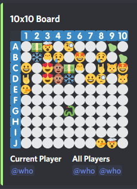

# Memory Match Game Discord Bot
 This is a discord game bot where you match the most cards to win. It allows 2-5 players in a game.

## Main Commands
**help/h/info/commands:** List information about all commands.

**play \<size\>:** Start a match game of a specified size. Size can be one number to create a square board or \<row column\>. The maximum row and column size is 10.

**join \<user\>:** Join a user's game. You must mention the user.

**start:** Starts the game you are the owner of.

**flip \<row column\>:** Flip a card over. Rows are the letters and columns are the numbers.

## Preview

---
This is a discord bot made with [discord.js](https://discord.js.org/#/).
